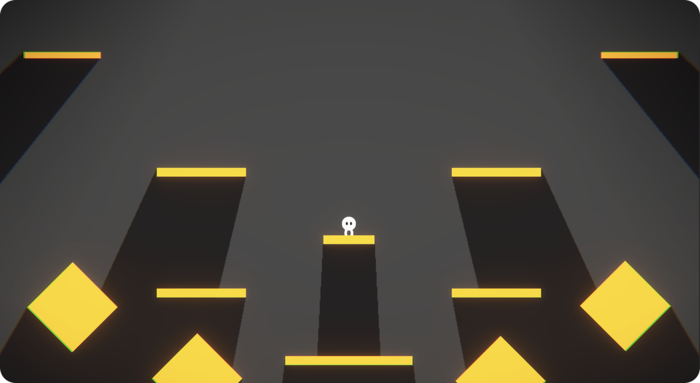
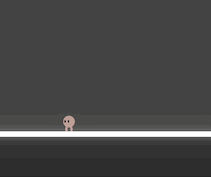
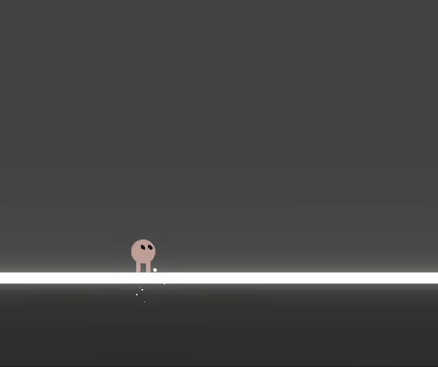
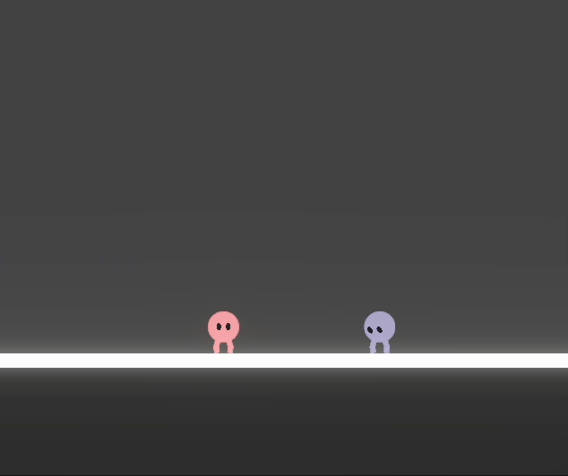
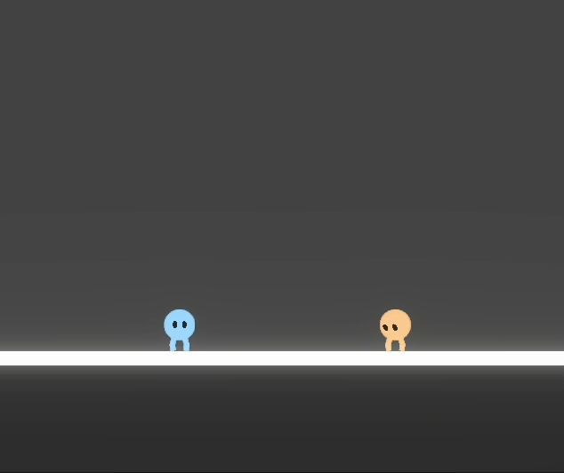
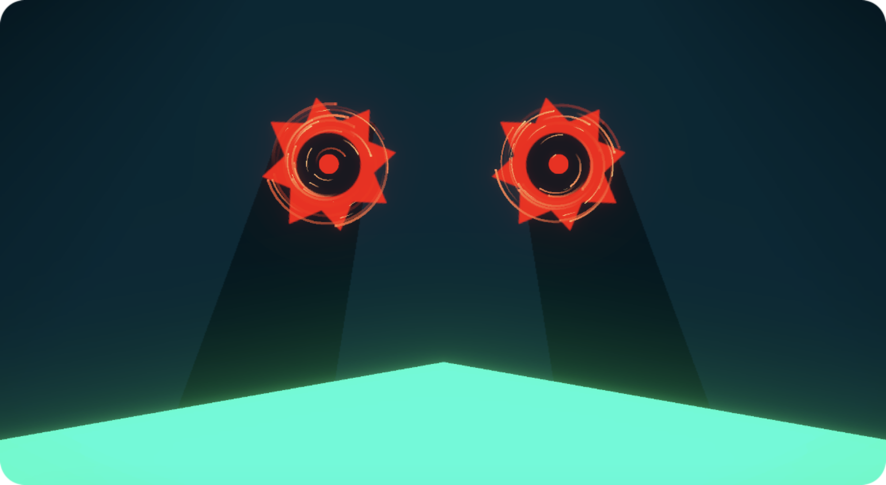
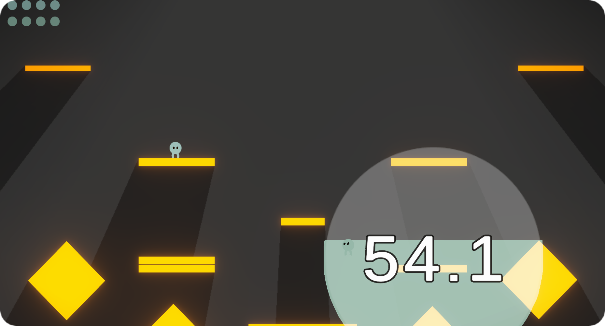
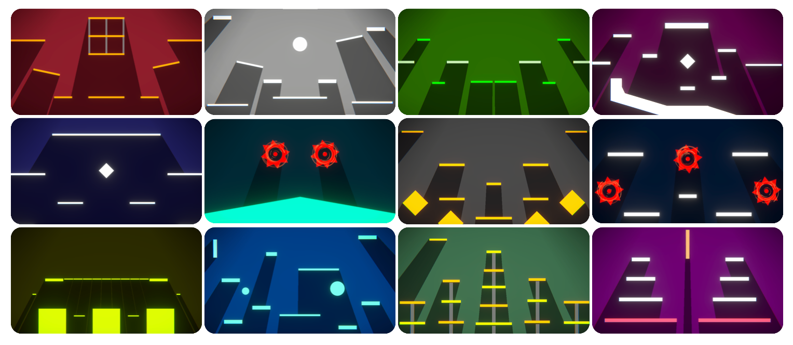
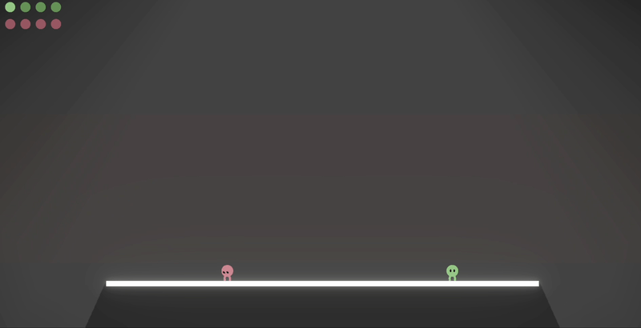

# PROS

[**다운로드 바로가기**](https://drive.google.com/file/d/1WJahNkOlYfkfCPFyd9jfuT0QUd1mSMPd/view?usp=sharing)

대쉬를 통해 상대에게 부딪치거나 상대방에 대쉬를 방어하여 상대를 장외로 날리는 것이 목표인 최대 4인 난투형 액션게임입니다. 

## 조작 방법

`A` `D` 를 통해 움질일 수 있고, `SPACE` 를 통해 점프할 수 있습니다. 점프한 상태에서 `SHIFT` 를 통해 마우스 방향으로 대쉬할 수 있습니다.

  

대쉬로 상대방에게 부딪쳐 상대방을 장외로 날릴 수 있습니다. 상대방이 대쉬를 사용할 때 타이밍에 맞추어 `F` 키를 누르면 방어하며 역으로 상대방을 장외로 날릴 수 있습니다.

## 게임 요소

PROS에는 플레이어가 한 명만 남을 때까지 진행되는 `서바이벌`모드와 맵에 랜덤하게 생성되는 구역을 빠르게 점령하는 `점령전`모드가 존재합니다.

  

게임 내에는 총 **14가지**의 다양한 맵이 존재합니다. 스테이지가 시작되면 플레이어는 랜덤하게 생성되는 맵에서 스테이지를 진행할 수 있습니다.

  

맵에는 랜덤하게 플레이어를 방해하는 이벤트가 발생하며 플레이어는 이를 피하거나 이용할 수 있습니다.

